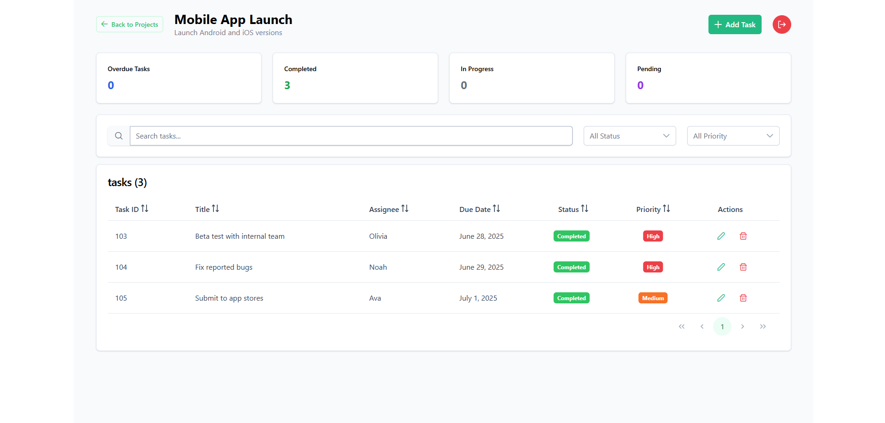

# Project & Task Management Dashboard

A modern, responsive project and task management dashboard built with React, TypeScript, and shadcn/ui components.

## Features

### Features

- Project dashboard with PrimeNG p-table and progress bars
- Project CRUD (add, edit, delete) with dialogs and validation
- Filter and search projects by status, owner, or name
- Expandable project rows for summaries/next tasks
- Task management per project: view, add, edit, delete tasks
- Inline editing for task status and due date
- Add/edit tasks using dialogs with validation
- Responsive and accessible UI with PrimeNG layouts
- Notifications via toast/messages
- Route guards and simulated authentication
- Loading indicators for better UX
- Bonus: Task filtering, drag-and-drop reordering, analytics cards, simulated API


## Project Structure

```
src/
├── app/
│   ├── core/
│   │   ├── components/
│   │   │   ├── alert-dialog/
│   │   │   ├── api-loader/
│   │   │   └── toast/
│   │   ├── guards/
│   │   │   ├── auth.guard.ts
│   │   │   └── main.guard.ts
│   │   ├── interceptors/
│   │   │   └── loading.interceptor.ts
│   │   └── services/
│   │       ├── alert-dialog.service.ts
│   │       ├── api-loader.service.ts
│   │       ├── auth.service.ts
│   │       └── toast.service.ts
│   │
│   ├── features/
│   │   ├── projects/
│   │   │   ├── components/
│   │   │   │   ├── project-card/
│   │   │   │   │   ├── project-card.component.css
│   │   │   │   │   ├── project-card.component.html
│   │   │   │   │   ├── project-card.component.spec.ts
│   │   │   │   │   └── project-card.component.ts
│   │   │   │   ├── project-dialog/
│   │   │   │   │   ├── project-dialog.component.css
│   │   │   │   │   ├── project-dialog.component.html
│   │   │   │   │   ├── project-dialog.component.spec.ts
│   │   │   │   │   └── project-dialog.component.ts
│   │   │   │   └── project-list/
│   │   │   │       ├── project-list.component.css
│   │   │   │       ├── project-list.component.html
│   │   │   │       ├── project-list.component.spec.ts
│   │   │   │       └── project-list.component.ts
│   │   │   ├── models/
│   │   │   │   ├── project.model.ts
│   │   │   │   └── projectProgress.ts
│   │   │   ├── projects-page/
│   │   │   │   ├── projects-page.component.css
│   │   │   │   ├── projects-page.component.html
│   │   │   │   ├── projects-page.component.spec.ts
│   │   │   │   └── projects-page.component.ts
│   │   │   └── services/
│   │   │       └── project.service.ts
│   │   │
│   │   └── tasks/
│   │       ├── components/
│   │       │   ├── task-card/
│   │       │   │   ├── task-card.component.css
│   │       │   │   ├── task-card.component.html
│   │       │   │   ├── task-card.component.spec.ts
│   │       │   │   └── task-card.component.ts
│   │       │   ├── task-dialog/
│   │       │   │   ├── task-dialog.component.css
│   │       │   │   ├── task-dialog.component.html
│   │       │   │   ├── task-dialog.component.spec.ts
│   │       │   │   └── task-dialog.component.ts
│   │       │   └── task-list/
│   │       │       ├── task-list.component.css
│   │       │       ├── task-list.component.html
│   │       │       ├── task-list.component.spec.ts
│   │       │       └── task-list.component.ts
│   │       ├── models/
│   │       │   └── task.model.ts
│   │       ├── services/
│   │       │   └── task.service.ts
│   │       └── tasks-page/
│   │           ├── tasks-page.component.css
│   │           ├── tasks-page.component.html
│   │           ├── tasks-page.component.spec.ts
│   │           └── tasks-page.component.ts
│   │
│   ├── landing/
│   │   ├── components/
│   │   │   └── dashboard-overview/
│   │   │       ├── dashboard-overview.component.css
│   │   │       ├── dashboard-overview.component.html
│   │   │       ├── dashboard-overview.component.spec.ts
│   │   │       └── dashboard-overview.component.ts
│   │   └── landing-page/
│   │       ├── landing-page.component.css
│   │       ├── landing-page.component.html
│   │       ├── landing-page.component.spec.ts
│   │       └── landing-page.component.ts
│   │
│   └── shared/
│       ├── models/
│       │   ├── projectStats.model.ts
│       │   └── taskStats.model.ts
│       └── services/
│           └── analytics.service.ts
│
├── environments/
│   ├── environment.prod.ts
│   └── environment.ts
│
├── app.component.css
├── app.component.html
├── app.component.spec.ts
├── app.component.ts
├── app.config.ts
├── app.routes.ts
├── index.html
└── main.ts

```

## Getting Started

### Prerequisites
- Node.js (v16 or higher)
- npm or yarn

### Installation

1. ## Clone the repository:
```bash
git clone <repository-url>
cd Projects_Pilot_ng_19
```

2. ## Install dependencies:
```bash
npm install
```

3. ## Install json-server (if not already installed)


Check if `json-server` is installed globally first. If not, install it by running the following command:

```bash
npm install -g json-server
```
Start the development server with json-server: 
  "scripts": { 
    "start": "npx concurrently \"ng serve\" \"json-server --watch db.json --port 3000\""
  }
```bash
npm start
```

4. ## Open your browser and navigate to `http://localhost:4200`

5. ## Start json-server for the mock API `(seperetly)`:
```bash
npm run json-server
```
Navigate to `http://localhost:3000/`

## Usage

### Navigation
- **Home Page** (`/`): Landing page with feature overview
- **Projects** (`/projects`): Main project dashboard
- **Tasks** (`/projects/:id/tasks`): Task management for specific project

### Managing Projects
1. Click "Add Project" to create a new project
2. Use the search bar to find specific projects
3. Filter projects by status using the dropdown
4. Click "View Tasks" to manage project tasks
5. Use the Edit button to modify project details

### Managing Tasks
1. Navigate to a project's task view
2. Click "Add Task" to create new tasks
3. Use filters to find specific tasks


### Landing Page


### Project Listing Page


### Task Page
